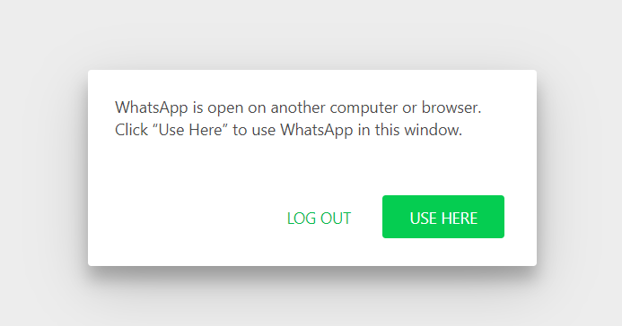
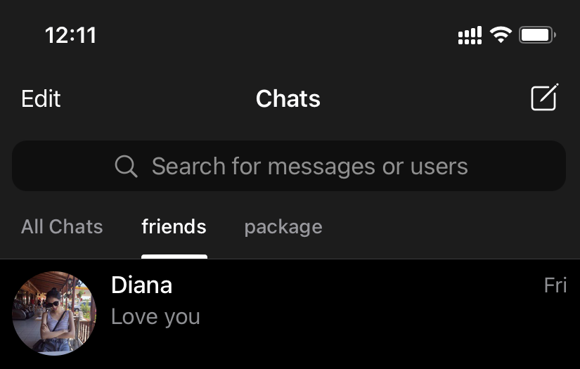
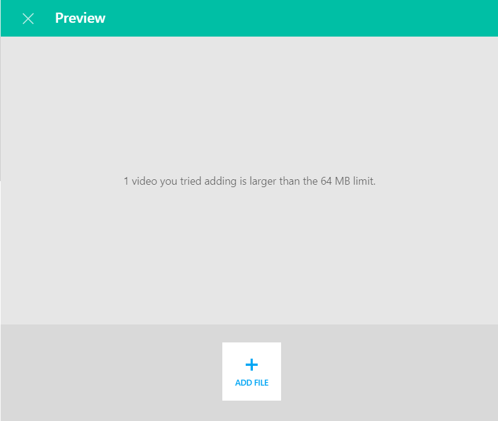

Telegram and WhatsApp are both messaging apps, and we know that WhatsApp has a larger user base (over 2 billion) and can be accessed in more countries (over 133 countries). On the other hand, Telegram has a small user base (over 400 million) and appears in fewer countries (over 20 countries). Data as of June 2020.

The following is a list of usability advantages that Telegram has but WhatsApp doesn't from my usage perspective.

## **Seamless usage on multiple devices without having to log out**

Telegram users can log into multiple devices without any lag and having to log out from another device to enter into a new one.

Whatsapp forces you to log out on one device before logging in to another.
This is a huge plus for professionals that work on multiple devices like myself: iphone, imac, and other laptops running on Windows.

## **Better chat management**

Telegram latest version (v6) allows you to segment your chats according to your own categories such as work, personal and unread. You can customize it by creating it for different groups of friends, family etc. This is a super useful feature that Whatsapp is lacking.

## **You can edit messages that you have already sent out!**

Telegram allows you to edit messages that you have already out instead of having to retype a new sentence as the correct version — a feature that Whatsapp lacks.
This keeps the chat clean and less notifications for both you and your recipient.
It will show the recipient that the message has been edited for simple audit trail. 

## Larger file sharing size(32x more)

You can use Telegram to send large files up to 2GB in size, which is great because most email providers have limits on attachment size. It is usually about 25MB, and depends on the email provider.

The maximum file size allowed for all media (photos, videos or voice messages) to be sent or forwarded through WhatsApp is 16 MB on all platforms.When we talk about transferring photos and videos, last thing we want is the quality to drop. Telegram does this better as it compresses less of the file as compared to Whatsapp — I guess this advantage is attributed directly to the fact that Telegram can handle a larger file transfer size.

